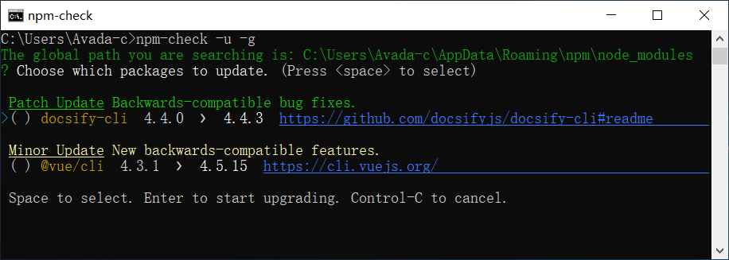

> + 更新package.json依赖包


使用npm-check检查npm依赖包是否有更新，错误以及不在使用的
````
#安装npm-check
npm i -g npm-check

````


````
#-u 显示UI界面，会列出所有符合的，空格选中，回车确认更新

#更新全局包
npm-check -u -g


#更新某个项目报，node_modules同级目录下运行
npm-check -u

````




