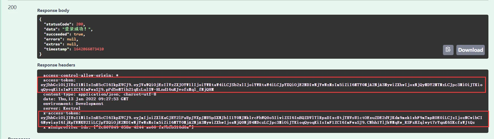
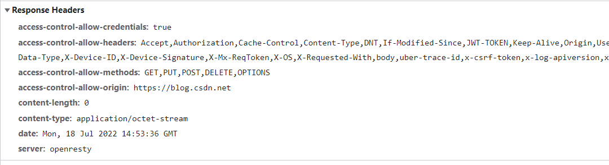

# 前端获取不到自定义响应头信息解决方法

在一次实际项目开发过程中我将access-token以及x-access-token放置于响应头中，如下图所示：


但是在前端获取到的response中无法看到自定义的请求头信息，即在响应数据的headers中无法看到access-token以及x-access-token的值。

原因  
系统为了安全性，默认只允许前端获取到如下几个响应头：  

* Cache-Control  
* Content-Language  
* Content-Type  
* Expires  
* Last-Modified  
* Pragma  

因此需要在后端进行配置。  



解决方法  
在后端添加响应头之后，需要在响应头中设置一个字段Access-Control-Expose-Headers，将自定义的响应头信息暴露出来供前端读取。具体实现代码如下：
````
// 设置响应报文头
httpContextAccessor.HttpContext.Response.Headers["access-token"] = accessToken;
httpContextAccessor.HttpContext.Response.Headers["x-access-token"] = refreshToken;
// 将自定义响应头暴露出来让前端捕获
httpContextAccessor.HttpContext.Response.Headers["Access-Control-Expose-Headers"] = "access-token,x-access-token";

````
其中httpContextAccessor是通过接口IHttpContextAccessor进行依赖注入实现的，从代码中可以看到后端响应头自定义的字段有access-token和x-access-token两个，因此需要在响应头中添加Access-Control-Expose-Headersv字段，其值为自定义的字段名，用逗号隔开，且只能设置一次。
````
this.$axios({
    url: "/api/user/login",
    method: "post",
    data: {
      username: "admin",
      password: "123456",
    },
  }).then(res => {
    this.accessToken = res.headers["acccess-token"];
    this.xAccessToken = res.headers["x-acccess-token"];
  });
````

以上代码仅是作为通用演示，正常开发过程可根据项目需求自行调整，例如获取到响应信息后即可将token存储至Vuex以及localStorage中为之后的请求提供身份凭证。


  
  