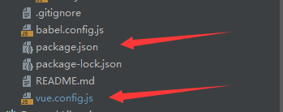
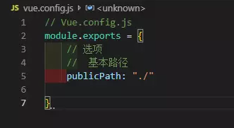

# Vue的 vue.config.js 配置  

> +  1. 为什么要配置 vue.config.js

由于 vue-cli 3 也学习了 rollup 的零配置思路，所以项目初始化后，没有了以前熟悉的 build 目录，也就没有了 webpack.base.config.js、webpack.dev.config.js 、webpack.prod.config.js 等配置文件。
但是有些内容需要进行相关的配置，所以我们还是要创建一个vue.config.js来进行数据修改，比如代理啥的

> +  2.里面的配置详解

vue.config.js 文件是一个可选的配置文件，存放在根目录中，要是有这个文件，在@vue/cli-service 启动的时候会自动加载，所以我们在修改里面的内容之后，要进行项目重新加载。 同时你也可以在package.json中的vue字段（这里有时间在研究）



配置选项：
首先页面里面出现这个 没有就自己写



每次在用的时候都是直接从网上找一个复制下来，用到哪个地方修改哪里，但是一直不知道具体是怎么操作，怎么使用，毕竟这关系到项目的架构，还是直接明白所有的用法靠谱，最后会写一个复制用的，但是还是顺着看完。

````
首先是 publicPath
{
  Type(类型): string
  Default(默认): '/'
}
1.项目部署的基础路径
2.我们默认假设你的应用将会部署在域名的根部，
  3.比如 https://www.my-app.com/
  4.如果你的应用时部署在一个子路径下，那么你需要在这里
指定子路径。比如，如果你的应用部署在
https://www.foobar.com/my-app/
  那么将这个值改为 `/my-app/`

拓展：把开发服务器假设在根路径，可以直接使用一个判断
publicPath :process.env.NODE_ENV === 'production' ? '/production-sub-path/' : '/'
````

````
outputDir (基本不动，打包目录不都是用那个吗)
{
  Type(类型): string
  Default(默认): 'dist'
}
1.将构建好的文件输出到哪里（或者说将编译的文件），当运行 vue-cli-service build 时生成的生产环境构建文件的目录。注意目标目录在构建之前会被清除 (构建时传入 --no-clean 可关闭该行为)。
````

````
assetsDir (基本上都是默认)
{
  Type(类型): string
  Default(默认): ''
}
1.放置生成的静态资源 (js、css、img、fonts) 的目录。
	注(我没懂)：从生成的资源覆写 filename 或 chunkFilename 时，assetsDir 会被忽略。
````

````
indexPath (没动过)
{
  Type(类型): string
  Default(默认): 'index.html'
}
1.指定生成的 index.html 的输出路径 (相对于 outputDir)。也可以是一个绝对路径。
````

````
filenameHashing (默认就行)
{
  Type(类型): boolean
  Default(默认): true
}
1(摘录).默认情况下，生成的静态资源在它们的文件名中包含了 hash 以便更好的控制缓存。然而，这也要求 index 的 HTML 是被 Vue CLI 自动生成的。如果你无法使用 Vue CLI 生成的 index HTML，你可以通过将这个选项设为 false 来关闭文件名哈希。
````

注意：这个是比较重要的有延伸，vue感觉上侧重于单页面应用，意思就是只有一个页面，里面的操作都是通过组件的切换来完成的但是你也可以使用多页面

<p class="list-header">单页面应用（spa）</p>

概念：只有一个html页面，所有跳转方式都是通过组件切换完成的。
优点：页面之间跳转流畅、组件化开发、组件可复用、开发便捷、易维护。
缺点：首屏加载较慢，加载整个项目中使用的css、js，SEO优化不好。

<p class="list-header">多页面应用（mpa）</p>
概念：整个项目有多个html，所有跳转方式都是页面之间相互跳转的。
优点：首屏加载较快，只加载本页所使用的的css、js，SEO优化较好。
缺点：页面跳转较慢。
vue 如何实现多页面应用 https://www.jianshu.com/p/eceb2ac9df90
  vue中如何配置多页面配置 https://www.jianshu.com/p/52c4913e0bf4

````  
  pages
{
  Type(类型): Object
  Default(默认): undefined
}
1.在 multi-page（多页）模式下构建应用。每个“page”应该有一个对应的 JavaScript 入口文件。
  举例子：
// 用于多页配置，默认是 undefined
pages: {
  index: {
    // 入口文件
    entry: 'src/main.js',　　/*这个是根入口文件*/
      // 模板文件
      template: 'public/index.html',
      // 输出文件
      filename: 'index.html',
      // 页面title
      title: 'Index Page'
  },
  // 简写格式
  // 模板文件默认是 `public/subpage.html`
  // 如果不存在，就是 `public/index.html`.
  // 输出文件默认是 `subpage.html`.
  subpage: 'src/main.js'　　　　/*注意这个是*/
},
````  

````  
lintOnSave (默认)
{
  Type(类型):  boolean | 'error'
  Default(默认): true
}
1. 是否在保存的时候使用 `eslint-loader` 进行检查。 有效的值：`ture` | `false` | `"error"`  当设
置为 `"error"` 时，检查出的错误会触发编译失败。
	3. 是否在保存的时候使用 `eslint-loader` 进行检查。
	4. 有效的值：`ture` | `false` | `"error"`
5. 当设置为 `"error"` 时，检查出的错误会触发编译失败。
````  

````  
runtimeCompiler (默认 我没用过)
{
  Type(类型):  boolean
  Default(默认): false
}
1. 是否使用带有浏览器内编译器的完整构建版本
2. 设置为 true 后你就可以在 Vue 组件中使用 template 选项了，
	但是这会让你的应用额外增加 10kb 左右。
````  


````  
transpileDependencies (没用过)
{
  Type(类型):  Array<string | RegExp>
Default(默认): []
}
1. 默认情况下 babel-loader 会忽略所有 node_modules 中的文件。
	如果你想要通过 Babel 显式转译一个依赖，可以在这个选项中列出来
3. babel-loader 默认会跳过 node_modules 依赖。
4. 通过这个选项可以显式转译一个依赖。
````  

````  
productionSourceMap (就只是知道这么个意思)
{
  Type(类型): boolean
  Default(默认): true
}
1. 如果你不需要生产环境的 source map，可以将其设置为 false 以加速生产环境构建。
````  

````  
crossorigin (不知道)
{
  Type(类型): string
  Default(默认): undefined
}
1.在生成的 HTML 中的 <link rel="stylesheet"> 和 <script> 标签上启用 Subresource Integrity
(SRI)。如果你构建后的文件是部署在 CDN 上的，启用该选项可以提供额外的安全性。
````  


<p class="list-header">webpack相关配置</p>

````
configureWebpack
Type:Object | Function

1.如果这个值是一个对象，则会通过 webpack-merge 合并到最终的配置中。
        2.如果这个值是一个函数，则会接收被解析的配置作为参数。
        该函数及可以修改配置并不返回任何东西，也可以返回一个被克隆或合并过的配置版本。

chainWebpack
Type: Function
1.是一个函数，会接收一个基于 webpack-chain 的 ChainableConfig 实例。
		允许对内部的 webpack 配置进行更细粒度的修改。
````

<p class="list-header">css相关配置</p>

````
// CSS 相关选项
css: {

  extract: true,
    Type: boolean | Object
  1. 将组件内的 CSS 提取到一个单独的 CSS 文件 (只用在生产环境中)
  2. 也可以是一个传递给 `extract-text-webpack-plugin` 的选项对象

  sourceMap: false,
    {
      Type(类型): boolean
      Default(默认): false
    }
  1. 是否开启 CSS source map？ 设置为 true 之后可能会影响构建的性能。

    loaderOptions: {},
  {
    Type(类型): Object
    Default(默认):  {}
  }
  1. 为预处理器的 loader 传递自定义选项。比如传递给
  2. sass-loader 时，使用 `{ sass: { ... } }`。

    modules: false
  {
    Type(类型): boolean
    Default(默认): false
  }
  1.为所有的 CSS 及其预处理文件开启 CSS Modules。
    		2. 这个选项不会影响 `*.vue` 文件。

},

// 在生产环境下为 Babel 和 TypeScript 使用 `thread-loader`
// 在多核机器下会默认开启。
parallel: require('os').cpus().length > 1,

  // PWA 插件的选项。
  // 查阅 https://github.com/vuejs/vue-cli/tree/dev/packages/@vue/cli-plugin-pwa
  pwa: {},
````


<p class="list-header">代理配置</p>

````
如果你的前端应用和后端 API 服务器没有运行在同一个主机上，
	你需要在开发环境下将 API 请求代理到 API 服务器。
	这个问题可以通过 vue.config.js 中的 devServer.proxy 选项来配置。
我们前边的 axios 就说了

// 配置 webpack-dev-server 行为。
devServer: {
  open: process.platform === 'darwin',
    host: '0.0.0.0',
    port: 8080,
    https: false,
    hotOnly: false,
    proxy: {
    '/api': {
      target: 'http://localhost:8880',
        changeOrigin: true,
        secure: false,
        // ws: true,
        pathRewrite: {
        '^/api': '/static/mock'
        // 请求数据路径别名,这里是注意将static/mock放入public文件夹
      }
    },
    
    //开发环境跨域配置,代码里写请求时用api这个前缀代替target目标前缀，然后通过本地node服务器去请求
    '/api': {
      target: 'http://www.baiyeyi.com/',
        changeOrigin: true,     //允许跨越
        pathRewrite: {
        '^/api': '',
      }
    },

  },
  before: app => {}
},
````


<p class="list-header">简洁版 很多都是默认的 不需要修改</p>

````
module.exports = {
  // publicPath:process.env.NODE_ENV === 'production' ? '/vue_workspac/aihuhuproject/' : '/',

  //基本路径
  publicPath: './',//默认的'/'是绝对路径，如果不确定在根路径，改成相对路径'./'
  // 输出文件目录
  outputDir: 'dist',
  assetsDir: 'static',
  indexPath: 'index.html',
  // eslint-loader 是否在保存的时候检查
  lintOnSave: true,
  // 生产环境是否生成 sourceMap 文件
  productionSourceMap: false,
  // css相关配置
  css: {
    // 是否使用css分离插件 ExtractTextPlugin
    extract: true,
    // 开启 CSS source maps?
    sourceMap: false,
  },
  // webpack-dev-server 相关配置
  devServer: {
    open: false,//open 在devServer启动且第一次构建完成时，自动用我们的系统的默认浏览器去打开要开发的网页
    host: '0.0.0.0',//默认是 localhost。如果你希望服务器外部可访问，指定如下 host: '0.0.0.0'，设置之后之后可以访问ip地址
    port: 8080,
    hot: true,//hot配置是否启用模块的热替换功能，devServer的默认行为是在发现源代码被变更后，通过自动刷新整个页面来做到事实预览，开启hot后，将在不刷新整个页面的情况下通过新模块替换老模块来做到实时预览。
    https: false,
    hotOnly: false,// hot 和 hotOnly 的区别是在某些模块不支持热更新的情况下，前者会自动刷新页面，后者不会刷新页面，而是在控制台输出热更新失败
    proxy: {
      '/': {
        target: 'http://xxxx:8080', //目标接口域名
        secure: false, //false为http访问，true为https访问
        changeOrigin: true, //是否跨域
        pathRewrite: {
          '^/': '/' //重写接口
        }
      }
    }, // 设置代理
    before: app => { }
  },
  // 第三方插件配置
  pluginOptions: {
    // ...
  }
};
````


<p class="list-header">总结 （重要）：</p>

1.
vue在工程化开发的时候依赖于 webpack ,而webpack是将所有的资源整合到一块后形成一个html文件 一堆 js文件, 如果将vue实现多页面应用,就需要对他的依赖进行重新配置,也就是修改webpack的配置文件.
  vue的开发有两种，一种是直接的在script标签里引入vue.js文件即可，个人感觉做小型的多页面会比较舒坦，一旦做大型一点的项目，还是离不开webpack。所以另一种方法也就是基于webpack和vue-cli的工程化开发。


2.
webpack 有个特性，基本的功能都是可以用配置去实现的，所以就造成一个特点“很容易忘记它”，所以就很有必要记录一下
简述一下
````
webpack 分为
Entry：入口
Output: 出口
Module 模块
Plugin 插件
DevServer 服务器配置
````