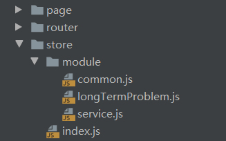

# vuex

> + 目录结构




> + index.js
````javascript
import Vue from "vue";
import Vuex from "vuex";

import common from "./module/common";
import service from "./module/service";
import longTermProblem from "./module/longTermProblem";

Vue.use(Vuex);

export default new Vuex.Store({
  modules: {
    common,
    service,
    longTermProblem,
  },
});
````


> + common.js
````javascript

export default {
  state: {
    pbiCode: "",
  },

  getters: {
    getPbiCode: state => state.pbiCode,
  },

  actions: {
    setPbiCode({commit}, data) {
      commit("setPbiCode", data);
    },
  },

  mutations: {
    setPbiCode(state, data) {
      state.pbiCode = data;
    },
  },
};
````


> + servic.js
````javascript
export default {
  namespaced: true, //多模块下用命名空间,解决重名问题. 默认情况下，模块内部的 action、mutation 和 getter 是注册在全局命名空间

  state: {
    serviceInfos: "",
  },

  getters: {
    getServiceInfos: state => state.serviceInfos,
  },

  actions: {
    setServicInfos({commit}, data) {
      commit("setServicInfos", data); //这里的setServicInfos是mutations里的方法,为了方便就和actions的用相同名称
    },
  },

  mutations: {
    setServicInfos(state, data) {
      state.serviceInfos = data;
    },
  },
};
````


> + longTermProblem.js
````javascript
export default {
  namespaced: true, 

  state: {
    totalData: [],
    detailsData: [],
  },

  getters: {},

  actions: {
    updateTotal({commit}, data) {
      commit(updateTotal, data);
    },
  },

  mutations: {
    updateTotal(state, data) {
      state.totalData = data;
    },
  },
};

````

> + 组件中调用
````javascript
//1 直接使用
this.$store.getters["getPbiCode"]
this.$store.getters["servic/getServiceInfos"]


//2.1 computed计算属性
//import { mapState, mapGetters, mapActions, mapMutations } from 'vuex';
computed: {
  ...mapState(["pbiCode"]),
  ...mapGetters(["getPbiCode"]),
  ...mapGetters("servic", ["getServiceInfos"]),

//2.2 别名状态下
  ...mapGetters({
    getCode: "getPbiCode",
    getIfo: "servic/getServiceInfos",
  }),

// this.getPbiCode
// this.getCode   别名


//****************************

//1 直接使用
this.$store.dispatch(["servic/setServicInfos"])

//2.1 methods方法
methods: {
  ...mapActions("servic", ["setServicInfos"]),

//2.2 别名状态下
  ...mapActions({
    getIfo: "servic/setServicInfos",
  }),
}

//this.getIfo()


//****************************

//1 直接使用
this.$store.commit(["servic/setServicInfos"])

//2.1 methods方法
methods: {
  ...mapMutations("servic", ["setServicInfos"]),

//2.2 别名状态下
  ...mapMutations({
    getIfo: "servic/setServicInfos",
  }),
},
````

> + wacth
````javascript
//没设置算属性,直接watch,不过最好用getters里的，这里监听整个longTermProblem，属性不多时
"$store.state.longTermProblem": {
  handler: ({totalData, chartData}) {
    
  },
  deep: true,
}


````


> + 补充

store里的this就是vue组件里的this.$store，如果是分模块，也可以通过this，获取其他模块的任何东西

actions方法里的第一个参数(可以解构出commit，getters，state)指向本模块；

要获取vue组件的this，可以通过第二个参数传进来
````javascript
this.$store.dispatch("defectTypeAnalysis/fnTest", {vm: this, data: "testTxt"});


//defectTypeAnalysis.js  defectTypeAnalysis模块

actions: {
  fnTest({commit, getters, state}, {vm, data}) {
    console.log(this); //store本身
    console.log(vm);  //调用此方法的vue组件的this
    console.log(data); //testTxt
    this.commit("setPbiCode", "9527"); //调用common的方法
  },
},


mutations: {
  fn111(state, data) {
    this.commit("defectTypeAnalysis/fn222", "99999")
  },

  fn222(state, data) {
    console.log(data);
  },
},


````

