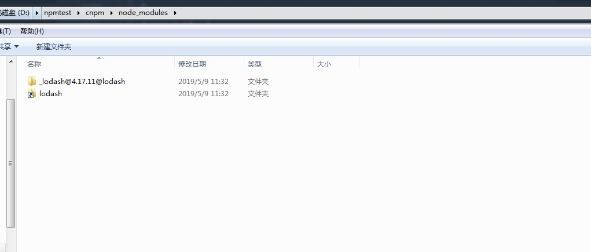
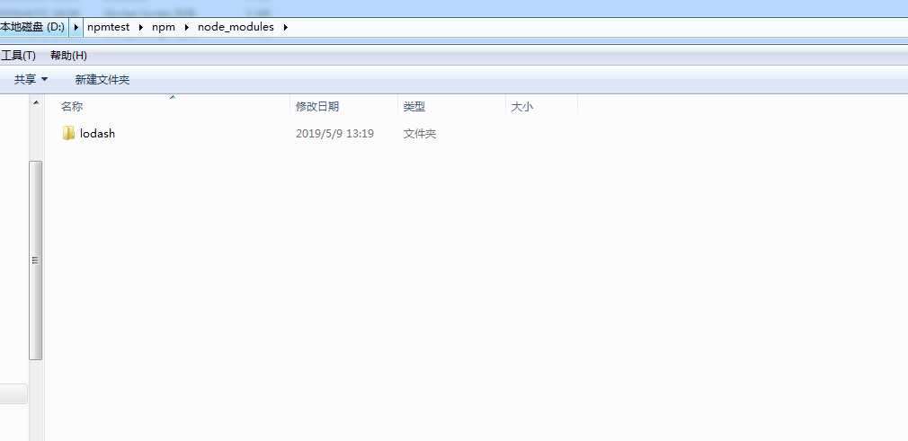
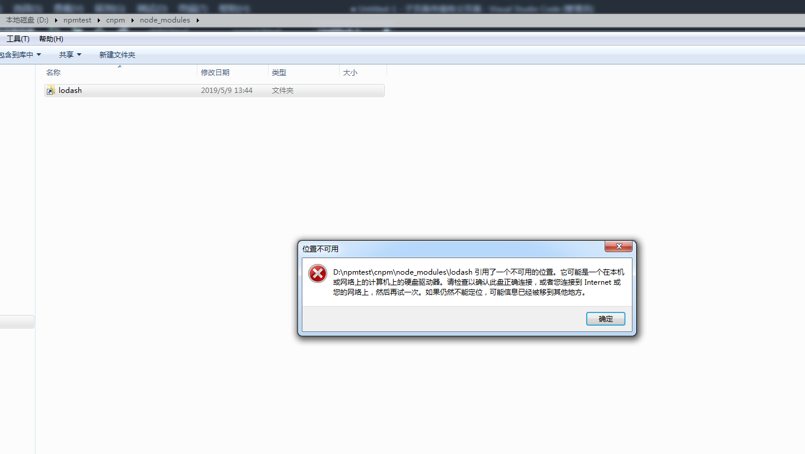

> + 查看源  修改源

````
npm config get registry
#OR
npm info express
#OR
npm config list


npm config set registry https:registry.npmjs.org

````

全局源配置文件位置: C:\Users\Avada-a\.npmrc  
可以直接修改此文件，https改成http网速可以好很多


> + 更改源(淘宝镜像) 

````
npm config set registry https://registry.npm.taobao.org
#OR 还原
npm config set registry https://registry.npmjs.org/
````


> + npm改成淘宝镜像与cnpm区别（20190509新增）

之前一直以为npm改成淘宝镜像后和cnpm本质是一样的，今天在研究package-lock.json时候发现，这两者还是有很大区别。特记录下：

先贴下截图对比：
1.使用cnpm安装lodash


 



 

2.使用改成淘宝仓库的npm安装lodash


 



通过截图会发现：

- cnpm安装模块的时候会在node_modules文件夹生成二个文件夹，一个以下划线 **_**开头以及版本号组成的名字，一个正常名字的模块，文件夹名字虽然不一样，但里面文件是一样的。
  比如执行cnpm install lodash,会在node_modules文件夹下生成两个文件夹：_lodash@4.17.11@lodash和lodash，

- 先执行了cnpm install lodash，然后再执行npm install lodash，npm安装的lodash会替换掉cnpm安装的lodash包（包括以下划线开头那个包），文件夹会只剩一个npm先安装的lodash包。再次npm uninstall lodash或者cnpm uninstall lodash,都会删除lodash包，此时插件包就变成空文件夹了。

- 先执行了cnpm install lodash，然后再执行npm uninstall lodash后，此时会报错

  ```
   npm ERR! code EINVALIDPACKAGENAME
   npm ERR! Invalid package name "_lodash@4.17.11@lodash": name cannot start with an underscore; 
   name can only contain URL-friendly characters
  ```

但是使用cnpm uninstall lodash后，不会报错，此时会删掉cnpm安装的两个包中其中一个即非下划线（正常名字）的包。剩余的那个包是可以正常通过鼠标点击打开的。然后在文件中require会报错，提示没有这个包。

- 先执行了cnpm install lodash，然后手动删除cnpm安装的两个包中其中一个即下划线（非正常名字）的包，剩余的那个包，发现无法通过鼠标点击打开了。然后在文件中require会报错，提示没有这个包。

 



- 所以，cnpm安装的的2个模块，两者应该存在引用关系，正常名字模块是非正常名字模块的索引，两者都必须存在才可以使用。但是npm安装下来就不存在这种情况了，因为只有一个正常名字模块。
- 实测发现，尽管使用npm改成淘宝仓库，发现安装速度还是远远比cnpm慢（当模块比较多的时候）。可能应该和cnpm安装的文件结构有关系吧。


