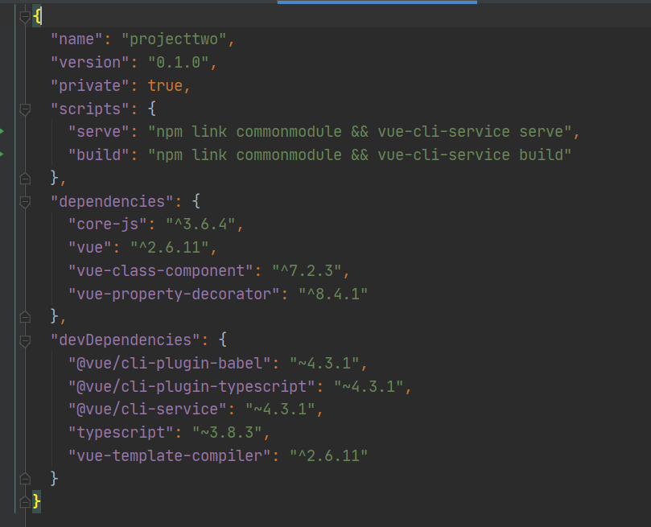

# npm link的用法

假如我们想自己开发一个依赖包，以便在多个项目中使用。  
一种可行的方法，也是npm给我们提供的标准做法，那就是我们独立开发好这个依赖包，然后将它直接发布到npm镜像站上去，等以后想在其他项目中使用的时候，直接npm install moduleName。   
但是，如果我们修改了这个依赖包的源码，就要重新发布到npm镜像站，这样做相对来说会有一点麻烦。  
我们希望有更方便一点的办法，npm link就是这样的一个简便方案。    


> + commonModule  

在`commonModule`下运行`npm init`命令，这会在`commonModule`下生成`package.json`文件  
还会创建一个符号链接（symlink），这个链接指向 npm link 命令执行的地方  
 


````
// methods.js
function print(text) {
  console.log("print--  ", text);
}
export {
  print
}
````

````
// inex.js
export * from "./tool/methods";
````


> + projectTwo

在项目目录下运行npm link packageName，packageName可以换成路径（index.js可以省略）  
需要注意的的是，`packageName`是取自包的公共模块的`package.json`中`name`字段，不是文件夹名称  

为了方便，可以加到项目脚本里  
  


````
<template>
  <div>
    <p>嘿嘿嘿</p>
  </div>
</template>

<script>
  import  { print } from "commonmodule";
  export default {
    methods: {
      print,
    },
    created() {
      this.print("哈哈哈");
    },
  }
</script>

<style lang="less" scoped></style>
````


================================


> + 第一步  

在一个包文件夹内执行 npm link 将在全局文件 {prefix}/lib/node_modules/<package> 内，创建一个符号链接（symlink），这个链接指向 npm link 命令执行的地方。  

> + 第二步 
 
到其它目录下，执行 npm link packageName 命令，将会创建一个从全局安装的 packageName 到当前文件内的 node_modules 下的符号链接。  
需要注意的的是， packageName 是取自包的 package.json 中 name 字段，不是文件夹名称。  
包的名称可能有作用域前缀，如果有， packageName 也要对应加上。  
  
  
> + 解除 link

到**项目**下执行下面的命令：
````
npm unlink --no-save package && npm install
````
npm uninstall 文档中可以发现，unlink 其实是 uninstall 的别名，实质上也是删除了包。  

包不需要的 link 的时候，建议也解除，到**包目录**下执行下面的命令：  
````
npm unlink  
````

  