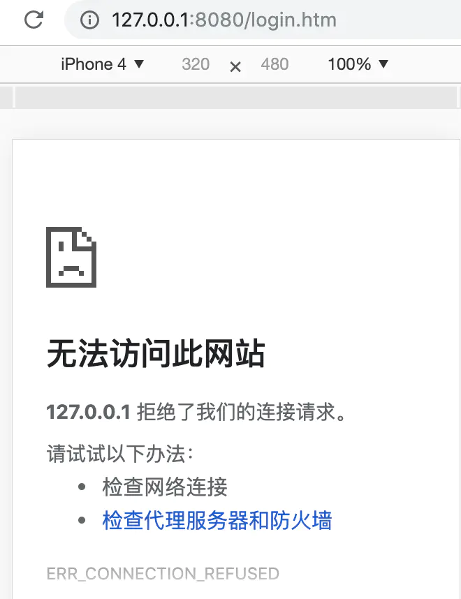
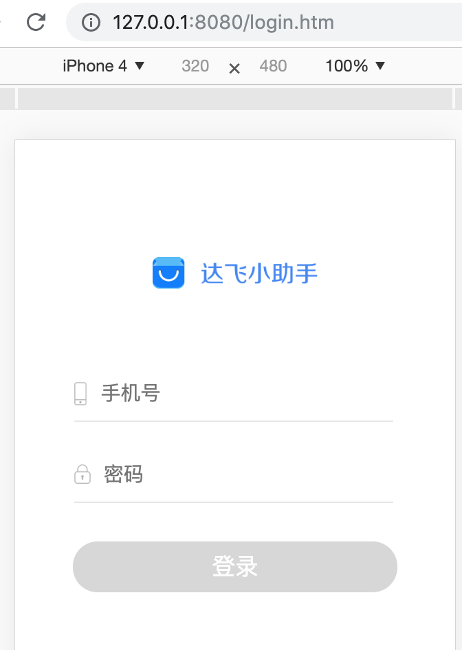
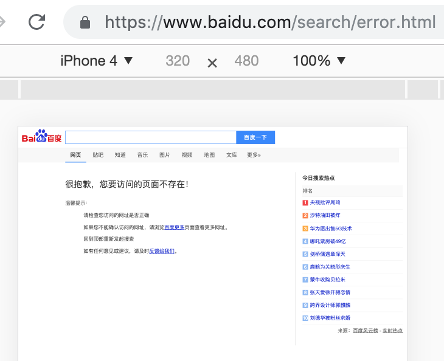

# http-server  OR  live-server

http-server 没热更新    
live-server 没跳转404.html


http-server更像是部署服务，live-server更适合开发调试


````
#安装
npm install live-server -g

npm i live-server -g
````


````
#启动
http-server

#简写
hs
````


**************************************************************


>+ http-server 是一个简单的零配置的命令行 http服务器，它足够强大便于生产和使用，用于本地测试和开发。

有时候我们打开一个文档使用file协议打开的时候，不能发送ajax请求，只能使用http协议才能请求资源，所以此时我们需要在本地建立一个http服务，通过IP加端口号，来访问资源，此时就用到了http-server

+ 全局安装 npm i http-server -g
+ 格式 http-server [path] [options]
+ 快速使用 http-server
+ 简写 hs


###### 参数  
-p 或者 --port 端口设置，默认是 8080  
-a 监听地址设置默认是 0.0.0.0  
-d 是否显示文件列表 默认true  
-i 显示自动索引 默认true  
-g 或者 --gzip 默认false，当文件的gzip版本存在且请求接受gzip编码时，它将服务于./public/some-file.js.gz，而不是./public/some-file.js  
-e 或者 --ext 如果没有提供默认文件扩展名(默认为html)  
-s 或者 --silent 禁止控制台日志信息输出  
–cors 允许跨域资源共享  
-o 启动服务后打开默认浏览器  
-c 设置缓存cache-control max-age heade存留时间（以秒为单位），示例：-c10是10秒，默认是3600秒，如果要禁用缓存就使用-c-1  
-U 或者 --utc 使用 UTC格式，在控制台输出时间信息  
-P 或者 --proxy 通过一个 url地址，代理不能通过本地解析的资源  


**-P 代理接口**  
有时候前端需要在本地运行项目，html在本地，但是接口在服务器  
在本地代码的根路径执行 hs -P http://m.feiyu007.com  
注意：打开的网址要和服务器上的网址路径相同，否则hs服务器不能通过url找到页面，会把html页面代理到http://m.feiyu007.com 下，以至于访问的是线上的页面。  
如果访问测试环境的接口，在本地设置host即可：  
````
192.168.1.236 m.feiyu007.com
````


**-P的使用**  
运行一个java项目，如果直接使用hs创建http服务的话，页面打不开，因为有些资源不能通过本地解析，所以要用到-P参数  

用hs创建http服务页面如下hs：  
  
找不到页面,因为login.htm页面在本地不能被解析  

增加-P参数创建页面如下hs -P https://pocketwap.dafy.com  
  
页面可以打开了，因为login.htm这个页面被代理到了https://pocketwap.dafy.com下面，访问的是https://pocketwap.dafy.com下面的login.htm  

如果-P后面的url是baidu hs -P https://www.baidu.com，页面如下： 
   
页面不存在,因为百度服务器里没有login.htm这个页面  
也就是说本地不能解析的资源会被代理到-P后面的url对应的服务器资源，而百度也不存在这些资源，所以无法打开，但是https://pocketwap.dafy.com域名下存在这些资源，所以可以正常打开。  

**那如何通过修改本地login.htm，显示到浏览器中呢**   
在whistle的Rules里配置http://pocketwap.dafy.com http://192.168.105.241:8080  

-S 或者 --ssl 使用https协议  
-C 或者 --cert ssl证书文件的路径，默认是cert.pem  
-K 或者 --key ssl密匙文件路径  
-h 或者 --help 显示帮助  
